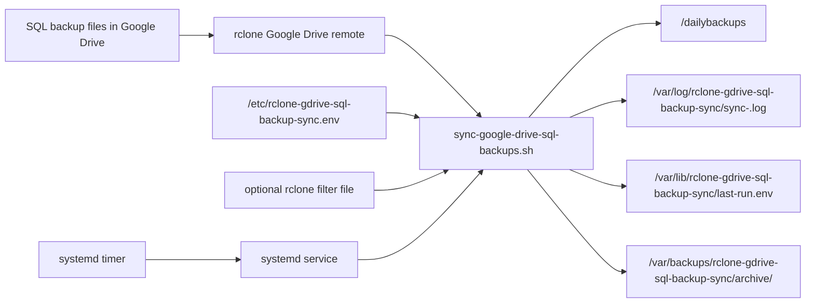

# Logic And Interconnections

## System Components

| Component | File Or Location | Responsibility |
| --- | --- | --- |
| rclone remote | rclone config, usually `/root/.config/rclone/rclone.conf` | Authenticates to Google Drive and exposes it as `gdrive:`. |
| Environment file | `/etc/rclone-gdrive-sql-backup-sync.env` | Holds source path, destination path, dry-run setting, and runtime options. |
| Sync script | `/usr/local/bin/rclone-gdrive-sql-backup-sync` | Performs validation, locking, rclone execution, logging, and summary writing. |
| Destination folder | `/dailybackups` | Stores the synced SQL backup files on the VPS. |
| Log folder | `/var/log/rclone-gdrive-sql-backup-sync` | Stores per-run text logs. |
| State folder | `/var/lib/rclone-gdrive-sql-backup-sync` | Stores lock file and last-run summary. |
| Archive folder | `/var/backups/rclone-gdrive-sql-backup-sync/archive` | Stores destination files deleted or overwritten by sync. |
| systemd service | `/etc/systemd/system/rclone-gdrive-sql-backup-sync.service` | Runs one sync job. |
| systemd timer | `/etc/systemd/system/rclone-gdrive-sql-backup-sync.timer` | Starts the service daily. |

## Data Flow



## Execution Sequence

```text
1. systemd timer fires, or an operator runs the script manually.
2. systemd service starts the sync script.
3. Sync script loads /etc/rclone-gdrive-sql-backup-sync.env.
4. Script validates:
   - environment file exists
   - rclone exists
   - rclone remote exists
   - Google Drive source path is specific
   - destination folder ends in dailybackups
   - optional filter file exists
   - destination filesystem has minimum required free space
5. Script creates required runtime directories.
6. Script opens a lock file with flock.
7. Script calculates destination files and bytes before sync.
8. Script builds rclone arguments.
9. Script runs rclone sync or rclone copy.
10. If enabled, script runs rclone check --one-way.
11. Script removes old logs and old archive folders if retention is enabled.
12. Script calculates destination files and bytes after sync.
13. Script writes /var/lib/rclone-gdrive-sql-backup-sync/last-run.env.
14. Script exits with success or failure.
```

## Pseudocode

```text
load ENV_FILE

set defaults for optional values

if GDRIVE_SOURCE_PATH is empty or root:
    fail

if basename(VPS_DESTINATION_DIR) != "dailybackups":
    fail unless explicitly allowed

create destination, log, state, and archive directories

open log file

acquire lock
if lock already held:
    fail

if rclone remote does not exist:
    fail

if free space is below MIN_FREE_SPACE_BYTES:
    fail

files_before = count destination files
bytes_before = count destination bytes

common_flags = logging + retries + transfer settings

if filter file is configured:
    common_flags += filter file

if checksum verification is configured:
    common_flags += --checksum

if dry run:
    rclone_args += --dry-run

if sync mode and archive deletion protection:
    rclone_args += --backup-dir archive/run-id
    rclone_args += --suffix .run-id

run rclone sync or copy

if post-sync check is enabled:
    run rclone check --one-way

files_after = count destination files
bytes_after = count destination bytes
bytes_delta = bytes_after - bytes_before

write last-run.env
exit
```

## Why The Script Uses rclone sync

The requirement says the VPS should sync from Google Drive. In rclone terms:

```bash
rclone sync source destination
```

means:

- Copy files that are new in source.
- Update files that changed in source.
- Delete destination files that no longer exist in source.

That is the correct behavior for a mirror, but it is risky for backups if someone deletes files from Google Drive by mistake. Therefore, the script uses `--backup-dir` by default so deleted or overwritten destination files are archived.

## sync Mode Versus copy Mode

| Mode | Command | Deletes Destination Files? | Use Case |
| --- | --- | --- | --- |
| `sync` | `rclone sync` | Yes, unless protected by archive behavior. | Keep VPS folder as exact mirror of Drive folder. |
| `copy` | `rclone copy` | No. | Safer one-way accumulation where old local files remain. |

The default is `sync` because that matches the stated requirement.

## Locking Logic

The script uses:

```bash
flock -n
```

on:

```text
/var/lib/rclone-gdrive-sql-backup-sync/sync.lock
```

If a second run starts while the first run is active, the second run exits. This prevents two rclone processes from writing to the same destination at the same time.

## Logging Logic

The script creates one log file per run:

```text
sync-<run-id>.log
```

`RUN_ID` uses UTC time:

```text
YYYYMMDDTHHMMSSZ
```

Example:

```text
20260506T023000Z
```

The script redirects both standard output and standard error into the log while still printing to the terminal or systemd journal.

## Summary Logic

The `EXIT` trap writes `last-run.env` even if the script fails after the state directory has been configured. This helps operators see the last known status without reading every log line.

Possible status values:

```text
success
failed
```

Possible check status values:

```text
skipped
running
success
failed
```

## Interconnection With systemd

The timer starts the service:

```text
rclone-gdrive-sql-backup-sync.timer
  -> rclone-gdrive-sql-backup-sync.service
      -> /usr/local/bin/rclone-gdrive-sql-backup-sync /etc/rclone-gdrive-sql-backup-sync.env
```

The timer uses:

```text
OnCalendar=*-*-* 02:30:00
Persistent=true
RandomizedDelaySec=15m
```

Meaning:

- Run daily at 02:30 VPS local time.
- If the VPS was down at the scheduled time, run after it comes back.
- Add up to 15 minutes of random delay to avoid all servers hitting external services at exactly the same second.

## Failure Boundaries

| Failure | Result |
| --- | --- |
| Missing env file | Script exits before sync. |
| Missing rclone binary | Script exits before sync. |
| Missing remote | Script exits before sync. |
| Bad destination folder name | Script exits before sync. |
| Not enough free space | Script exits before sync. |
| rclone transfer failure | Script exits non-zero and writes failed summary. |
| post-sync check failure | Script exits non-zero and writes failed summary. |
| Lock already held | Script exits before sync. |
